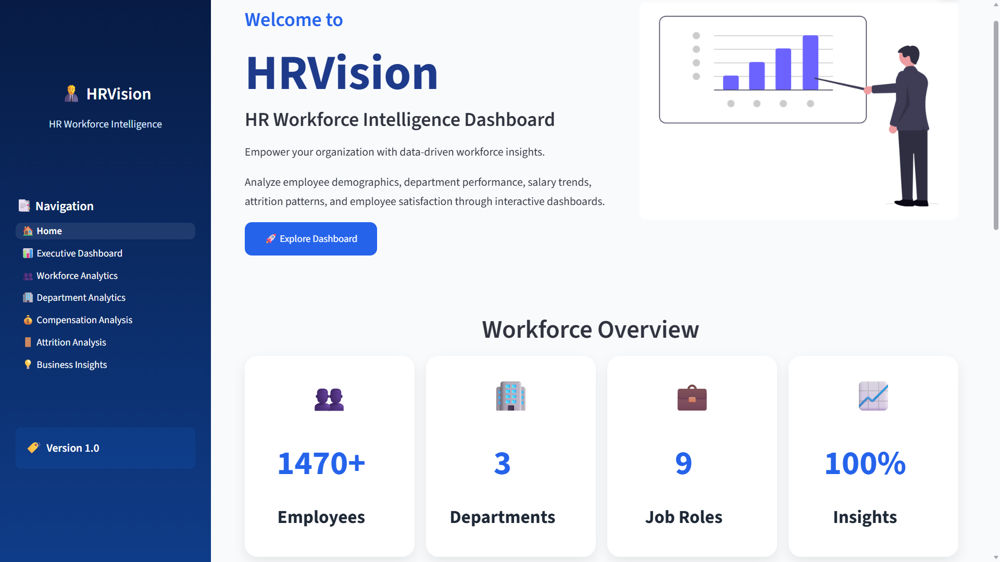
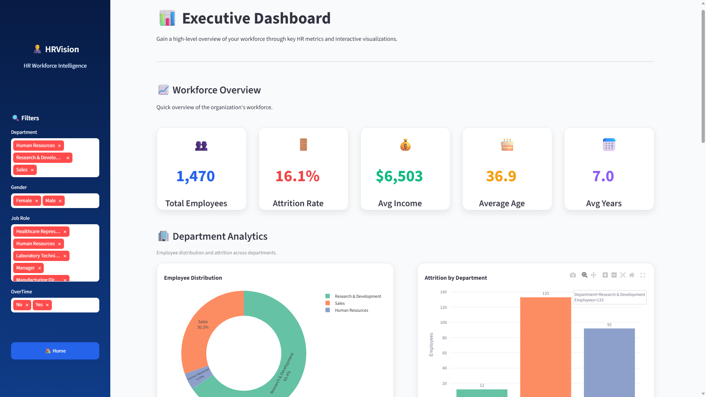
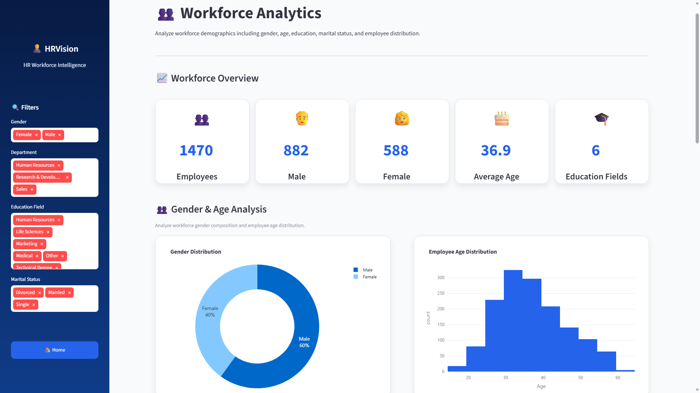
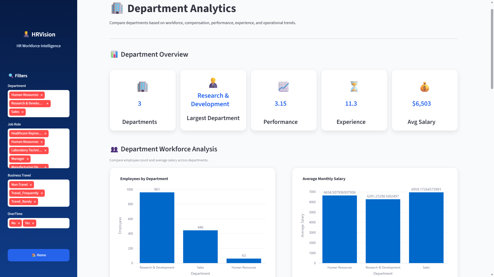
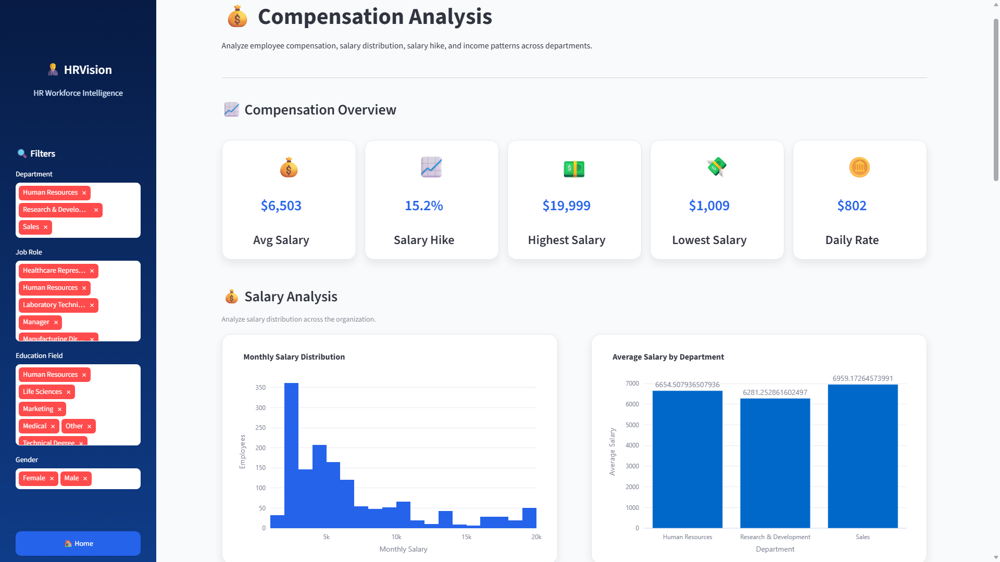
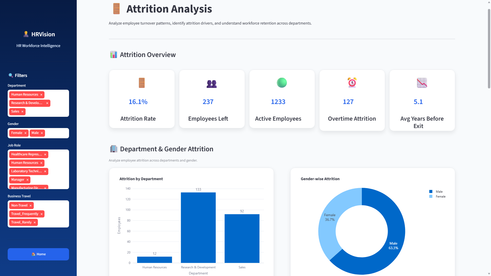
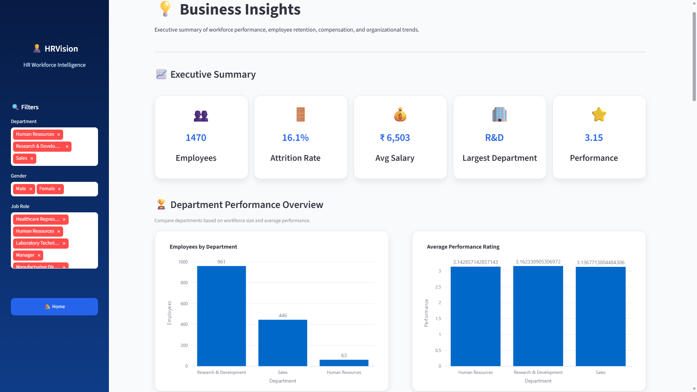
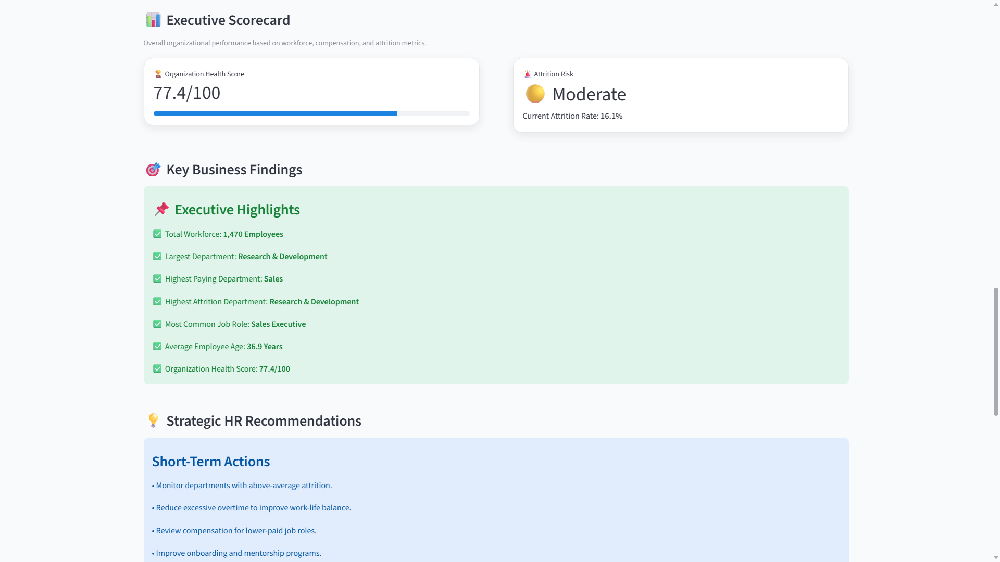

# 👨‍💼 HRVision – HR Workforce Intelligence Dashboard

<p align="center">


</p>

---

## 📌 Overview

**HRVision** is a modern **HR Workforce Intelligence Dashboard** built with **Streamlit**, **Plotly**, and **Pandas** to help organizations analyze employee data and make informed HR decisions.

The dashboard transforms raw HR data into interactive visualizations, executive summaries, and actionable business insights covering workforce demographics, compensation, department performance, and employee attrition.

Designed with a clean and professional interface, HRVision provides an intuitive experience for HR professionals, managers, and business leaders.

---


## 📸 Project Preview

### 🏠 Home Page

<p align="center">

</p>

### 📊 Executive Dashboard

<p align="center">

</p>

### 👥 Workforce Analytics

<p align="center">

</p>

### 🏢 Department Analytics

<p align="center">

</p>

### 💰 Compensation Analysis

<p align="center">

</p>

### 🚪 Attrition Analysis

<p align="center">

</p>

### 💡 Business Insights

<p align="center">


</p>

---

# ✨ Features

## 🏠 Home

- Professional landing page
- Modern UI
- KPI highlights
- Responsive layout

---

## 📊 Executive Dashboard

- Executive KPIs
- Department overview
- Compensation overview
- Workforce overview
- Interactive charts

---

## 👥 Workforce Analytics

- Gender distribution
- Age distribution
- Education analysis
- Marital status
- Business travel analysis
- Job role analysis

---

## 🏢 Department Analytics

- Department performance
- Workforce distribution
- Salary comparison
- Experience analysis
- Overtime analysis
- Job role analysis

---

## 💰 Compensation Analysis

- Salary distribution
- Salary by department
- Salary by job role
- Salary hike analysis
- Experience vs salary
- Daily & hourly rate analysis

---

## 🚪 Attrition Analysis

- Attrition rate
- Attrition by department
- Gender attrition
- Job role attrition
- Overtime impact
- Business travel impact

---

## 💡 Business Insights

- Executive summary
- Organization health score
- Attrition risk assessment
- Strategic HR recommendations
- Management action plan

---

# 📊 Dashboard Pages

| Page | Description |
|-------|-------------|
| 🏠 Home | Project overview |
| 📊 Executive Dashboard | Executive KPIs & overview |
| 👥 Workforce Analytics | Employee demographics |
| 🏢 Department Analytics | Department performance |
| 💰 Compensation Analysis | Salary insights |
| 🚪 Attrition Analysis | Employee turnover |
| 💡 Business Insights | Executive recommendations |

---

# 🛠️ Tech Stack

### Frontend

- Streamlit

### Data Analysis

- Pandas
- NumPy

### Visualization

- Plotly Express

### Programming Language

- Python

### Deployment

- Render

---

# 📂 Project Structure

```text
HRVision/
│
├── app.py
├── requirements.txt
├── runtime.txt
├── render.yaml
├── README.md
│
├── assets/
│   ├── hero.png
│   ├── logo.png
│   └── style.css
│
├── data/
│   └── HR_Analytics.csv
│
├── pages/
│   ├── Executive_Dashboard.py
│   ├── Workforce_Analytics.py
│   ├── Department_Analytics.py
│   ├── Compensation_Analysis.py
│   ├── Attrition_Analysis.py
│   └── Business_Insights.py
│
└── utils/
    ├── charts.py
    └── data_loader.py
```

---

# ⚙️ Installation

## Clone Repository

```bash
git clone https://github.com/milan-7417/HRVision.git
```

```bash
cd HRVision
```

---

## Create Virtual Environment

```bash
python -m venv venv
```

### Windows

```bash
venv\Scripts\activate
```

### Linux / macOS

```bash
source venv/bin/activate
```

---

## Install Dependencies

```bash
pip install -r requirements.txt
```

---

## Run Application

```bash
streamlit run app.py
```

---

# 📈 Key Business Insights

HRVision helps organizations:

- Monitor employee attrition
- Compare departmental performance
- Analyze workforce demographics
- Evaluate salary distribution
- Identify workforce trends
- Support data-driven HR decisions

---

# 🎯 Future Enhancements

- AI-powered HR chatbot
- Predictive attrition modeling
- Employee performance prediction
- PDF report generation
- Excel export
- Email reports
- Authentication system
- Database integration
- Cloud deployment enhancements

---

# 🤝 Contributing

Contributions are welcome.

1. Fork the repository
2. Create a feature branch

```bash
git checkout -b feature-name
```

3. Commit changes

```bash
git commit -m "Add new feature"
```

4. Push changes

```bash
git push origin feature-name
```

5. Open a Pull Request

---

# 📄 License

This project is licensed under the **MIT License**.

---

# 👨‍💻 Developer

**Milan Kumar**

**AI & Machine Learning Enthusiast**


---

## ⭐ If you found this project useful, please consider giving it a Star!